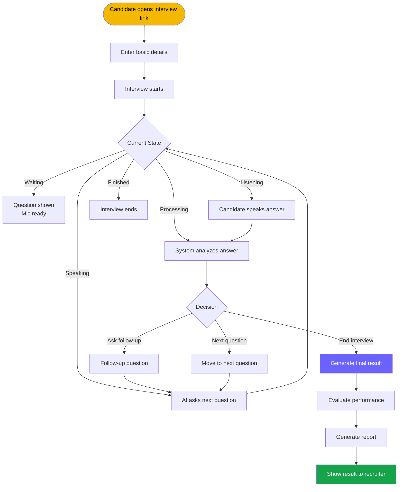
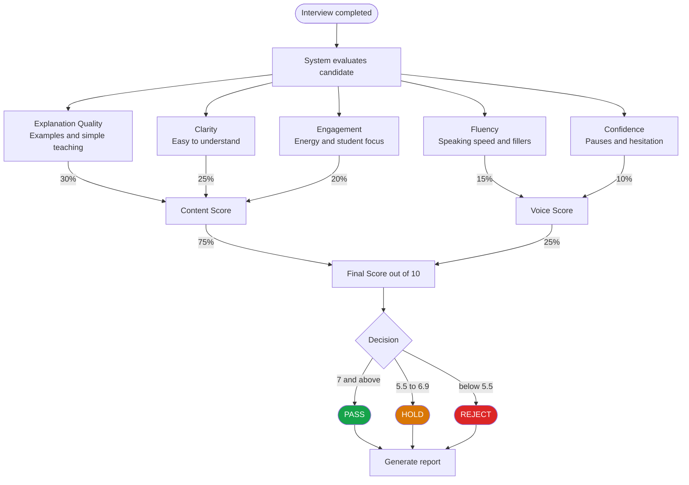

# Cuemath AI Tutor Screener

An AI-powered voice interview platform that screens Cuemath tutor candidates automatically. Candidates speak their answers to 4 teaching questions, the AI probes weak answers with follow-ups, and a judge model scores 5 dimensions to produce a Pass / Hold / Reject verdict. all without a human recruiter in the loop.

---

## What Was Built

A fully serverless Next.js application that conducts a structured voice screening interview and generates a detailed recruiter report. The candidate opens a link, speaks answers to 4 questions about teaching, and the system handles everything else transcription, conversation management, follow-up probing, scoring, and PDF report generation.

**The problem picked:** Cuemath's recruiter team spends significant time on first-round screening calls that mostly test communication quality and teaching temperament not deep math knowledge. This is exactly the kind of structured, repeatable assessment that AI can handle well, freeing recruiters for final-round conversations that actually need human judgment.


## Evaluation Logic


The system evaluates each candidate across two key areas:
- **Content (what they teach)**
- **Voice (how they speak)**

---

### Content Score (75%) — Teaching Ability

Evaluates how well the candidate explains concepts to students.

- **Explanation Quality (30%)**
  - Uses simple steps and real-life examples  

- **Clarity (25%)**
  - Easy to understand, avoids jargon  

- **Engagement (20%)**
  - Shows energy, student focus, and interaction  

**Range:** up to 7.5  
**Source:** LLM-based evaluation using structured prompts  

---

### Voice Score (25%) — Delivery Quality

Evaluates how clearly and confidently the candidate speaks.

#### Fluency (15%)
- Based on speaking speed (Words Per Minute)
  - 110–150 → ideal pace  
  - 90–110 or 150–170 → acceptable  
  - Outside → too slow or too fast  
- Penalized for filler words (e.g., *um, uh, like*)

#### Confidence (10%)
- Starts from a base score  
- Increased by **thinking pauses** (before speaking)  
- Decreased by **hesitation pauses** (mid-sentence)  

**Range:** up to 2.5  
**Source:** Fully rule-based, derived from audio signals  

---

### Voice Signals Used

All signals are extracted from **word-level timestamps**:

- **WPM (Words Per Minute)** → calculated using actual speech duration  
- **Filler Count** → detected using word matching  
- **Thinking Pauses** → gaps before sentence start  
- **Hesitation Pauses** → gaps within sentences  

This ensures objective and consistent evaluation.

---

### Final Decision

- **7 and above → Pass**  
- **5.5 to 6.9 → Hold**  
- **Below 5.5 → Reject**

---
---

## Key Decisions and Tradeoffs

**Whisper + GPT-4o-mini instead of GPT-4o audio input**
GPT-4o native audio would cost ~$0.42/interview. The Whisper → text → GPT pipeline costs ~$0.05. The tradeoff is losing real-time audio features (tone of voice, emotion) but the voiceSignalExtractor recovers the most actionable signals (WPM, pauses, fillers) from Whisper's word-level timestamps for free.

**Stateless serverless architecture**
No database. Session state lives entirely in React refs on the client and is passed with every API call. This makes the system trivially deployable to Vercel with zero infrastructure. The tradeoff is that a browser refresh loses the session acceptable for a screener where candidates complete in one sitting.

**One follow-up maximum per question**
Allowing more probes would feel like an interrogation and would inflate turn count unpredictably. The 1 follow-up cap is enforced both in the GPT prompt and server-side in `respond.js` the server guard means a hallucinating model can never create infinite probe loops regardless of what it returns.

**Report stored server-side in `/tmp`**
`sessionStorage` only works in the same browser tab. Using `/tmp` means the recruiter can open the report link in any browser, on any device, after the candidate has left. The tradeoff is that Vercel's `/tmp` is ephemeral it clears on cold starts. For production, this would be replaced with a database write.

**TTS prefetch parallelism**
See the Challenges section below.

---

## Cost Per Interview

| Item | Cost |
|---|---|
| Whisper — 5 min audio | $0.006 |
| 4–7 GPT-4o-mini turns | $0.008 |
| 1 judge call GPT-4o-mini | $0.005 |
| TTS-1 — 4 questions | $0.012 |
| **Total** | **~$0.03–0.05** |

---

## Tech Stack

| Layer | Choice |
|---|---|
| Frontend + Backend | Next.js 14 (pages router, API routes) |
| Deployment | Vercel serverless |
| Voice input | Browser MediaRecorder API |
| Silence detection | Web Audio API (RMS energy) |
| STT | OpenAI Whisper `whisper-1` `verbose_json` |
| LLM | GPT-4o-mini (conversation + judging) |
| TTS | `tts-1` voice: `nova` speed: `0.95` |
| Voice signals | Pure JS — voiceSignalExtractor.js |
| Score verification | Pure JS — verdictCalculator.js |

---

## Interesting Challenges

### 1. The 7–11 Second Latency Wall

**Problem:** The first version of the pipeline was fully sequential:

```
transcribe (2–3s) → respond/GPT (3–5s) → TTS fetch (2–3s) → play
                                                              ↑ 7–11s total
```

After every answer the candidate sat in silence for up to 11 seconds waiting for the AI to respond. In a voice interview this feels broken like the call dropped.

**Solution:** TTS prefetch starts the instant `respond` returns, running in parallel with React state updates:

```
transcribe (2–3s) → respond/GPT (3–5s)
                                  ↓ respond returns
                       TTS prefetch starts ←──────────┐
                       state updates (~0ms)             │ parallel
                       await ttsPromise ───────────────┘ (already buffered)
                       play instantly
```

The key pattern in `interview.js`:

```js
const ttsPromise = prefetchAudio(aiResponse); // fires immediately, no await
// ... all state updates happen while TTS loads in background
const preloadedAudio = await ttsPromise;      // already buffered by now
await speakText(aiResponse, preloadedAudio);  // plays instantly
```

This eliminated the TTS round-trip (~2–3s) from perceived latency. The candidate now hears the AI response almost the moment GPT finishes the audio was loading while state was updating.

---

### 2. The MicButton Click-to-Stop Race Condition

**Problem:** The original `MicButton` used `onMouseDown` to start recording and `onMouseUp` to stop it. A single click fires `mouseDown` then `mouseUp` in immediate succession so every tap both started and stopped recording instantly. The recording state would flash on for one frame and immediately go to `processing` with 0 bytes of audio captured.

**Root cause:** `onClick = mouseDown + mouseUp`. When `onMouseDown` set state to `recording`, `onMouseUp` was already firing against the new `recording` state and calling `stopRecording`.

**Solution:** Replaced the entire press-and-hold model with a toggle pattern using a single `onClick` handler:

```js
const handleClick = () => {
  if (isRecording) onRelease();   // second click = stop
  else onPress();                  // first click = start
};
```

The button also visually transforms idle state shows a round mic button, recording state shows a pill-shaped "Stop recording" button. This made the interaction model unambiguous to candidates and eliminated the race condition entirely.

---

### 3. Whisper File Format Rejection on Windows

**Problem:** `formidable` saved uploaded audio to a temp directory but without a file extension. The OpenAI SDK uses the filename to detect audio format a file with no extension caused Whisper to return `400 Invalid file format` on every transcription attempt. The interview appeared to work (graceful degradation returned empty transcripts) but no answers were ever transcribed.

This was compounded by Windows path handling `fs.createReadStream(filepath)` was resolving relative paths against the project root instead of the OS temp directory, causing `ENOENT: no such file or directory, open 'D:\GenAI\ai-tutor\audio.webm'`.

**Solution:** Three fixes combined:
1. Explicitly set `uploadDir: os.tmpdir()` in formidable config so the temp path is always absolute
2. Copy the file to a new path with `.webm` extension before sending to Whisper
3. Use `new File([buffer], 'audio.webm', { type: 'audio/webm' })` instead of a file stream this sets the MIME type explicitly at the SDK level regardless of filename

```js
const fileBuffer  = fs.readFileSync(namedPath);
const whisperFile = new File([fileBuffer], 'audio.webm', { type: 'audio/webm' });
```

---

### 4. questionBank Field Name Mismatch — The Silent Interview Freeze

**Problem:** The interview appeared to work TTS played, mic recorded, Whisper transcribed but the interview never progressed past Question 1. The AI would rephrase Q1 indefinitely in increasingly creative ways.

**Root cause:** `questionBank.js` used `mainQuestion` as the field name, but `respond.js` (generated earlier in development) was reading `QUESTION_BANK[i].main`  which returned `undefined`. GPT was receiving `nextMainQuestion: undefined` in every prompt, so it never had a valid question to move to and kept probing Q1.

The bug was silent no errors, no 500s, just an AI that apparently found Q1 endlessly fascinating.

**Fix:** One character change in `respond.js`:
```js
// Before (broken):
QUESTION_BANK[nextQuestionIndex].main

// After (fixed):
QUESTION_BANK[nextQuestionIndex].mainQuestion
```

**Lesson:** Field name mismatches between agent files are invisible at runtime when the consuming code gracefully handles `undefined`. The fix was straightforward once identified but took significant debugging because everything else appeared to be working.

---

## What Would Be Improved With More Time

**Persistent storage** — Replace `/tmp` JSON files with a proper database (Supabase or PlanetScale). Currently reports are lost on Vercel cold starts. A proper store would also enable a recruiter dashboard showing all candidates ranked by score.

**Real-time transcript display** — Show the candidate a live transcript of what Whisper heard, so they can confirm the AI understood them before the response plays. This would reduce anxiety and give candidates a chance to clarify if Whisper misheard.

**Calibration across subjects** — The current question bank only covers Mathematics. Adding Science, English and Coding question sets with subject-specific strong/weak signals would make the screener useful across Cuemath's full subject offering.

**Confidence intervals on scores** — Run the judge call twice with temperature 0.1 and report a range (e.g. "Explanation: 6–7") rather than a single number. This would give recruiters a sense of how certain the model is about borderline Hold cases.

**Mobile optimisation** — The current UI was built desktop-first. Mobile mic permissions behave differently across iOS Safari and Android Chrome, and the silence detection thresholds need tuning for louder environments.

**Admin dashboard** — Currently recruiters access reports via a URL with a session ID they receive from the candidate. A proper `/recruiter` dashboard listing all completed interviews sorted by score, with filter by subject and verdict, would make this production-ready.

---

## File Structure

```
ai-tutor/
├── .env.local                    # OPENAI_API_KEY, RECRUITER_SECRET
├── package.json
│
├── Agents/
│   ├── voiceSignalExtractor.js   # Whisper timestamps → WPM/pauses/fillers
│   ├── verdictCalculator.js      # Weighted score math → Pass/Hold/Reject
│   ├── questionBank.js           # 4 questions + follow-ups + signals
│   └── prompts.js                # All GPT-4o-mini system prompts + model config
│
├── pages/
│   ├── _app.js
│   ├── index.js                  # Landing page + tutorial modal
│   ├── interview.js              # Main state machine
│   ├── thankyou.js               # Candidate end screen + admin access
│   └── recruiter/report/
│       └── [sessionId].js        # Protected recruiter report + PDF
│
├── pages/api/
│   ├── tts.js                    # text → TTS-1 nova → mp3
│   ├── transcribe.js             # audio blob → Whisper → voiceSignal
│   ├── respond.js                # transcript → GPT-4o-mini → aiDecision
│   ├── assess.js                 # full session → judge → report JSON
│   └── report/
│       └── [sessionId].js        # serves /tmp/report_*.json to recruiter
│
├── components/
│   ├── MicButton.jsx             # Toggle mic, pulse animation, stop pill
│   ├── WaveformVisualizer.jsx    # Live frequency bars from Web Audio API
│   ├── ProgressBar.jsx           # Q1–Q4 dots + connectors
│   └── ScoreCard.jsx             # Full recruiter report card
│
└── styles/
    └── globals.css
```

---

## Running Locally

```bash
git clone <repo>
cd ai-tutor
npm install
```

Create `.env.local`:
```
OPENAI_API_KEY=sk-...
RECRUITER_SECRET=cuemath2026
```

```bash
npm run dev
# → http://localhost:3000
```

After completing an interview, access the recruiter report via the **🔒 Report (Admin only)** button on the thank you page. Password: `cuemath2026`.

---

## Interview Flow Summary

1. Candidate enters name and subject on the landing page
2. AI speaks a warm opening and Q1 via TTS (Nova voice)
3. Candidate clicks mic → records answer → clicks mic again to stop
4. Whisper transcribes audio; voiceSignalExtractor extracts WPM, fillers, pauses
5. GPT-4o-mini evaluates the answer and decides: follow-up, next question, or end
6. AI speaks response + next question; TTS prefetch runs in parallel with state updates
7. Loop repeats for up to 4 main questions + 4 follow-ups (7 turns max)
8. Final judge call scores 5 dimensions; verdictCalculator verifies the math
9. Report saved server-side; candidate sees thank-you screen
10. Recruiter accesses full scored report with PDF download

---
